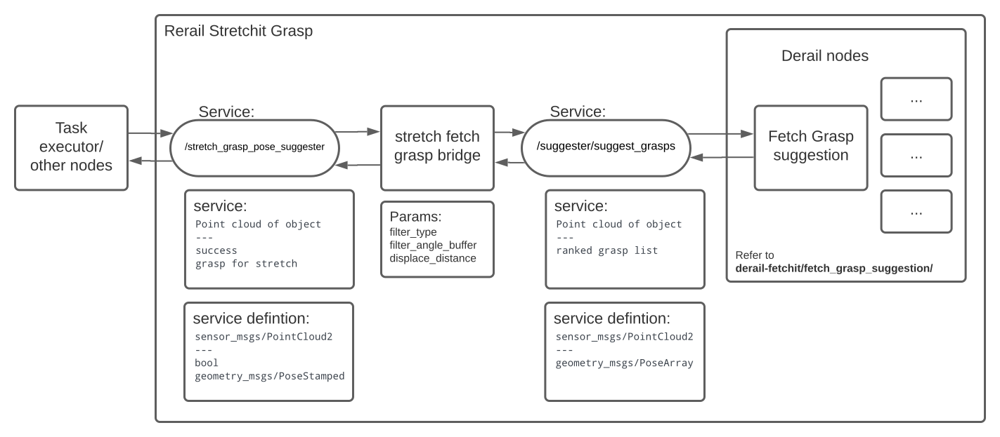

# Rerail_Stretchit_Grasp
Contains ROS packages for generating grasp pose for stretch given a segmented point cloud of the object of interest.
# Setup
In case of any issues refer to [Notes](#notes).
1. Install the fetch_grasp_suggestion dependencies
   ```
   sudo apt-get install python-matplotlib
   pip install treeinterpreter
   pip install -U scikit-learn==0.18.1 
   ```
2. Clone the repo to your workspace.
3. Build your workspace using `catkin_make`
4. (optional: place the rosbag file to  `$(find grasp_pkg_tests)/bag_files` and current expected name is `perception_multiple_obj_sparse.bag`. Can modify bag file details in `rerail_stretchit_grasp/grasp_pkg_tests/launch/grasp_rosbag.launch.` ROS bag should contain the camera and point cloud related topics and tf. (Bag file is available on SnowPiecer))
5. Setup a ROS network with Stretch  (if not using bag files and not runnning everything on the robot) 
# Interfacing with the grasping module (For Task exector)
To run the required nodes launch:
   ```
   roslaunch stretch_fetch_grasp_bridge grasp_modular.launch
   ```

Use the "/stretch_grasp_pose_suggester" service. The service message type is [stretch_fetch_grasp_bridge/StretchGraspPosev2](https://github.com/gt-rail-internal/rerail_stretchit_grasp/blob/main/stretch_fetch_grasp_bridge/srv/StretchGraspPosev2.srv) which is defined as follows:  
```
sensor_msgs/PointCloud2 point_cloud # segmented point cloud for the object of interest
---
bool success
geometry_msgs/PoseStamped grasp_pose 
```
The point cloud is the segmented point cloud of the object of interest, not the entire point cloud. 
For task executor: this should be the point cloud returned from the rerail_segmentation.
# Node
**stretch_grasp_filter**  
* **Published Topics:**  
   * `/stretch_grasp/filtered_grasp_poses`([geometry_msgs/PoseArray](https://docs.ros.org/en/melodic/api/geometry_msgs/html/msg/PoseArray.html))  
   Publishes all the poses that have been filtered. (Mainly for debugging and visualization)
   * `/stretch_grasp/single_grasp_pose`([geometry_msgs/PoseStamped](https://docs.ros.org/en/noetic/api/geometry_msgs/html/msg/PoseStamped.html))
   Publishes the grasp retruned by the service. This is the grasp that would be implemented. (Mainly for debugging and visualization)
   * `/stretch_grasp/debug_grasp_pose`([geometry_msgs/PoseStamped](https://docs.ros.org/en/noetic/api/geometry_msgs/html/msg/PoseStamped.html))
   This publishes the grasp before displacement. (Mainly for debugging and visualization)
* **Services Servers**
   * `/stretch_grasp_pose_suggester` ([stretch_fetch_grasp_bridge/StretchGraspPosev2](https://github.com/gt-rail-internal/rerail_stretchit_grasp/blob/main/stretch_fetch_grasp_bridge/srv/StretchGraspPosev2.srv))
   This takes a segmented point cloud of an object and returns the grasp for the object that can be executed by the stretch.
* **Services Client**
   * `/suggester/suggest_grasps` ([rail_manipulation_msgs/SuggestGrasps](https://github.com/GT-RAIL/rail_manipulation_msgs/blob/master/srv/SuggestGrasps.srv))
   This node sends the point cloud it received and fetch_grasp_suggestion would return a list of ranked grasps. For more details refer to [derail-fetchit/fetch_grasp_suggestion](https://github.com/gt-rail-internal/derail-fetchit/blob/dev/fetch_grasp_suggestion/README.md#suggester)

* **Parameters**  
   * `/stretch_grasp/filter_angle_buffer` (int,10)  
   Buffer angle (in degrees) used for filtering. Refer to [Detailed script documentation](#filtering-grasps)
   * `/stretch_grasp/displace_distance` (double,0.03)  
   The distance (in meters) to diplace the grasp pose.Refer to [Detailed script documentation](#displace-grasp).
   * `/stretch_grasp/filtering_type` (string,'all')  
   The type filtering to do. There are 4 possible values: 'frontal', 'top_down', 'lateral' and 'all'. For more details refer to [Detailed script documentation](#filtering-grasps).


# Detailed script documentation

For details in the derail-fetchit node refer [here](https://github.com/gt-rail-internal/derail-fetchit/tree/dev/fetch_grasp_suggestion).
The main node in this package is the stretch_grasp_filter.py. It performs 3 main tasks on the grasp list generated from "fetch grasp suggestion":
1. Filtering grasp
2. Aligns grasp for Stretch
3. displaces grasp

## Filtering grasps
The type of grasp can be set using the rosparam called `/stretch_grasp/filtering_type`. The deafult filter is "all". 
There are 4 types of grasps: "frontal", "top_down", "lateral" and "all".
* Frontal:  
This filters the grasps that are parallel to the ground plane. It does not have to perfectly parallel. There is a buffer angle of 10 degrees. So the angle made by the x-axis of the grasp and the ground plane should be &plusmn;10 degrees. Note: the buffer value of 10 degrees can be set by the rosparam called `/stretch_grasp/filter_angle_buffer`. 
* Top_down:  
This filters grasps that are pointing towards the ground plane. The x-axis of the gripper pose is perpendicular to the ground plane. Similar to earlier there is a buffer of &plusmn;10 which can be set by the rosparam called `/stretch_grasp/filter_angle_buffer`
* Lateral:  
These filter grasps that have the antipodal point that are parallel to the ground. That is the y-axis (gripper closing axis) is parallel to the ground surface. Angle buffer also applies to this filtering.
* All:  
There is no filtering. All the grasps from Fetch are accepted. 

## Align grasps
The stretch gripper can only yaw. Since it has only 4DOF, the 6DOF gripper pose Fetch cannot be directly used. The filtering helps filter viable grasps but the grasp may need to be rotated to before giving it to the manipulation node. The aligned graps is generated using the following logic.
```
new_aligned_z_axis = [0,0,1] # this is fixed
new_aligned_x_axis = orignal_y_axis X new_aligned_z_axis 
new_aligned_y_axis = new_aligned_z_axis X new_aligned_x_axis
Note: A X B is the crosproduct of A and B.
```
The new aligned grasp aims maintain the antipodal points close to the suggested grasp. 
## Displace grasp
Fetch has a parallel jaw gripper while Stretch has to 2 suction cups on the gripper end. One issue was that ciruclar objects like the can would slip. Displacing the gripper pose by a few cm along the x-axis of the gripper helps grasp the object better. Although this could lead to worse perfomance when antipodal points need to be preserved such as picking up a bowl. The amount of displacement can be set by the rosparam called `/stretch_grasp/displace_distance`. Default value for the displacement is 0.03 meters.  
# Testing
Note: Current testing instructions work for branch V0. But V0 does not have complete parameter implementation. TODO: create testing for cleaned up code.
## Testing on stretch

1. launch stretch driver (on robot)
   ```
   roslaunch stretch_core stretch_driver.launch
   ```
2. launch stretch camera (on robot)
   ```
   roslaunch stretch_core d435i_high_resolution.launch
   ```
3. Launch segmentation nodes # Need to move this to rerail_segmentation
   ```
   roslaunch stretch_fetch_grasp_bridge segmentation_modular.launch 
   ```
4. Launch grasp nodes
   ```
   roslaunch stretch_fetch_grasp_bridge grasp_modular.launch
   ```
5. Testing with dummy task executor
   ```
   rosrun stretch_fetch_grasp_bridge task_executor_dummy.py
   ```
This execution will calculate the grasp pose of the first indexed object by rail segmentation and publish it to the topic called "/stretch_grasp/single_grasp_pose".


## Testing with ROS bag
For easy testing you could use a rosbag instead of runnning on the robot. Refer to [setup](#setup) regarding bag file location.The step to run using rosbag are as follows:
1. Launch the rosbag
   ```
   roslaunch grasp_pkg_tests grasp_rosbag.launch 
   ```
2. Launch segmentation nodes # Need to move this to rerail_segmentation
   ```
   roslaunch stretch_fetch_grasp_bridge segmentation_modular.launch 
   ```
3. Launch grasp nodes
   ```
   roslaunch stretch_fetch_grasp_bridge grasp_modular.launch
   ```
4. Testsing with dummy task executor
   ```
   rosrun stretch_fetch_grasp_bridge task_executor_dummy.py
   ```
# Notes
## plot.cpp causing build issues
while building rail agile. Need to add the following header to plot.cpp in   rail_agile/src/agile_grasp/plot.cpp:
```
#include <boost/thread/thread.hpp>
```
## rail segmentaion configuration
Rail segmentation relies on a config file that requires specifying the table region infront of the robot. Ensure that the parameters are set correctly.
## classifier node died while running grasp_suggestor.launch
In fetch_grasp_suggestion/scripts/classifier_node.py
change 
```
#!/usr/bin/env python
to
#!/usr/bin/env python3
```
## sklearn not found
```
pip install -U scikit-learn==0.18.1
```

